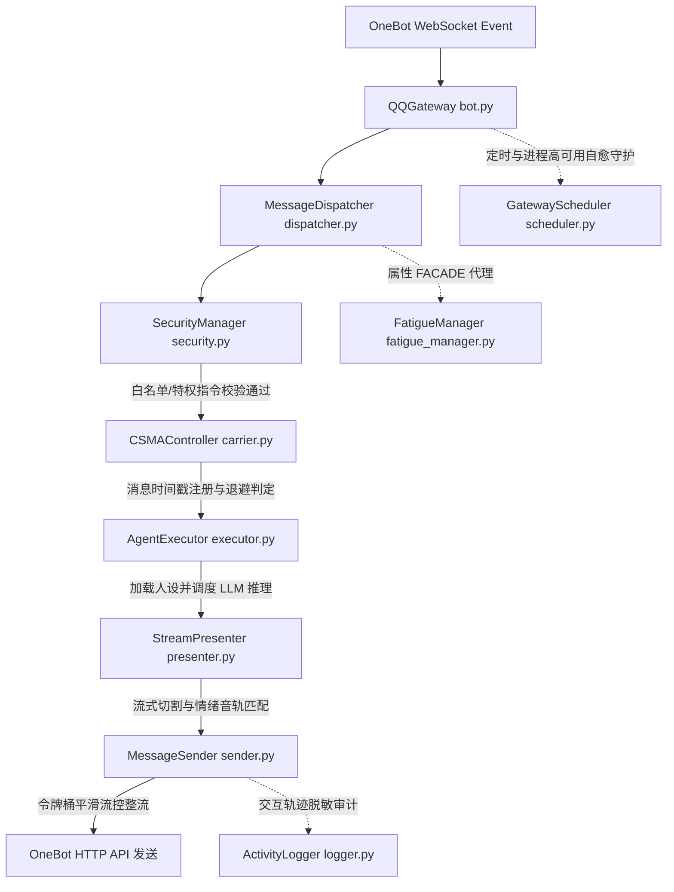

# 【企业级】QQ 智能消息网关核心设计、组件接口与高并发防死锁（CSMA/CD）运维指南

## 一、 概述与核心重构目标

在肖亮个人 AI 代理（XL Agent）的上一代演进中，物理消息网关（bot.py 和 dispatcher.py）混杂了过多系统级、业务级及认知级的硬粘连逻辑。为了实现高并发环境下的系统鲁棒性，保障大模型计费开销可控并彻底杜绝高频消息造成的串行死锁，我们本着 MVC 极简与高内聚设计思想，对网关进行了深度的组件物理剥离与解耦。

本指南作为企业级系统设计说明书（System Design Document）与运维手册，详尽阐述了解耦后八大核心子系统的拓扑结构、 Class 级别接口设计规范、内存数据库状态 Schema、CSMA/CD 交互时序以及生产环境下的运维拉起指南。

---

## 二、 架构演进与层级拓扑结构

重构后，网关在物理层面上由八个单一职责的子模块协作构成。系统数据流与控制流的层级拓扑架构如下：



---

## 三、 组件接口设计规范 (Component API Specifications)

为了确保各解耦组件之间具备极高的内聚性与清晰的边界，系统对每个类的 Class 级别 API 接口进行了企业级规范定义。

### 1. 物理通信与连接维持 (bot.py)
[Class] QQGateway
负责维持底层 WebSocket 长连接，接收原始 QQ 消息事件包，并作为 Gateway 系统的上下文总线容器。
- __init__(self, agent_factory)
  - 传入参数: agent_factory (Callable, 用于延迟组装 Agent 实例的工厂函数)
  - 职责: 初始化通信 session、装载 MessageDispatcher 并挂载 GatewayScheduler。
- run(self) -> None
  - 职责: 启动 WebSocket 长连接主循环，并启动 GatewayScheduler 后台守护。
- stop(self) -> None
  - 职责: 优雅关闭全部连接会话并释放资源。

### 2. 载波监听冲突检测总线 (carrier.py)
[Class] CSMAController
实现防抢话与避让退避算法的核心控制器，防止高频提问导致的大模型脑细胞碎屑输出。
- __init__(self, context, backoff_seconds = 1.2)
  - 传入参数: context (QQGateway 实例), backoff_seconds (float, 载波退避等待时长，默认为 1.2 秒)
- register_message(self, session_key: str) -> float
  - 传入参数: session_key (str, 会话唯一标识)
  - 返回类型: float (当前时间的单调时间戳)
  - 职责: 记录并更新当前会话最新发言的单调时间戳。
- wait_for_carrier_sense(self, session_key: str, this_msg_time: float) -> bool
  - 传入参数: session_key (str), this_msg_time (float, 本次消息进入时间戳)
  - 返回类型: bool (是否检测到载波冲突，返回 True 表示有更新的发言，应退避避让)
  - 职责: 在非阻塞 sleep 挂起期间监听是否有更新的发言灌入。
- is_collision(self, session_key: str, task_start_time: float) -> bool
  - 传入参数: session_key (str), task_start_time (float, 推理开始的单调时间戳)
  - 返回类型: bool (大模型推理中途是否被插嘴碰撞打断)
  - 职责: 在大模型推理的流式逐字输出循环首行以及最终发送前，进行强行冲突时序判定，阻断半成品输出。

### 3. 平滑发包与流控整流 (sender.py)
[Class] MessageSender
负责 OneBot HTTP 协议消息发送、文本 Markdown 标签自动降解、SPLIT 气泡切割与时延平滑处理。
- __init__(self, bot)
  - 传入参数: bot (QQGateway 实例)
  - 职责: 挂载 TokenBucketLimiter 实例并初始化发包配置。
- send(self, msg_type: str, user_id: str, group_id: str, text: str, skip_delay: bool = False) -> None
  - 传入参数: msg_type (str, 'private' 或 'group'), user_id (str), group_id (str), text (str), skip_delay (bool)
  - 职责: 在通过限流器获取令牌后，对文本进行降解并调用 OneBot 发送接口。
- send_chunk(self, msg_type: str, user_id: str, group_id: str, text: str) -> None
  - 职责: 处理多段 SPLIT 气泡和 WAIT 时延平滑发包。

[Class] TokenBucketLimiter
基于无锁排队算法的平滑令牌桶，解决高并发协程死锁。
- __init__(self, capacity: float = 5.0, refill_rate: float = 0.67)
  - 传入参数: capacity (float, 最大爆发包容量), refill_rate (float, 令牌每秒填充率)
- acquire(self) -> None
  - 职责: 微秒级占锁更新 allow_at 时间指针，并在锁外并发挂起 asyncio.sleep()。

### 4. 系统定时与健康探测自愈 (scheduler.py)
[Class] GatewayScheduler
系统高可用定时任务与守护自愈中心。
- __init__(self, context, bot)
  - 传入参数: context (GatewayContext 总线), bot (QQGateway 实例)
- start(self) -> None
  - 职责: 启动夜间电台选题智能轮询、晨间播客合成下载和 GPT-SoVITS 语音服务健康探测三大后台守护协程。
- stop(self) -> None
  - 职责: 优雅清理、取消所有后台常驻协程，杜绝协程溢出。

### 5. 疲劳状态机与休眠反思管理器 (fatigue_manager.py)
[Class] FatigueManager
接管疲劳度累加、休眠冷却判定、过载报警提示生成和离线反思进化逻辑。
- __init__(self, dispatcher)
  - 传入参数: dispatcher (MessageDispatcher 实例)
- adjust_fatigue(self, session_key: str, increment: float, event: dict) -> None
  - 职责: 平滑增减或重置疲劳值。当疲劳值达到 100.0 时，触发休眠反思冷却任务。

### 6. 活动轨迹脱敏审计日志 (logger.py)
[Class] ActivityLogger
隔离审计系统输入输出轨迹，确保物理网关零文件 I/O 阻碍。
- __init__(self, bot)
- log_activity(self, category: str, content: str, user_id: str = None) -> None
  - 职责: 物理脱敏安全敏感信息（如 API-KEY 等令牌）并写入持久化日志。

### 7. 认知决策推理执行器 (executor.py)
[Class] AgentExecutor
承载核心 ReAct 大模型异步推理引擎及管理员写操作卡片授权审批 (_PermEvent)。
- __init__(self, context, dispatcher)
- execute_agent_run(self, agent, raw: str, session_key: str, msg_type: str, user_id: str, group_id: str, sender_name: str, task_start_time: float) -> None
  - 职责: 驱动 Agent 开始执行循环，接收事件流，判定敏感操作并挂起 _PermEvent 事件锁等待审批回复。

### 8. 流式渲染与格式切分 (presenter.py)
[Class] StreamPresenter
流式分句切片渲染与情绪音轨匹配。
- __init__(self, agent, dispatcher, session_key, msg_type, user_id, group_id, sender_name, task_start_time)
- present_delta(self, delta: str) -> None
  - 职责: 将大模型流式吐出的逐字 delta 整理成句子气泡，匹配情绪前缀切换语音。

---

## 四、 内存数据库与状态字典 Schema 设计

由于网关服务是一个高实时性的异步并发应用，重构后对所有共享状态字典进行了收敛，将其组织为结构化的内存数据库 Schema：

### 1. 会话休眠状态字典
- 字典键名: dispatcher._sleep_modes
- 数据类型: dict[str, bool]
- 键定义: session_key (例如 'user_1705919142' 或 'group_999999')
- 值定义: bool (True 表示当前会话因疲劳过载处于休眠冷却期，不响应新指令)

### 2. 系统疲劳数值字典
- 字典键名: dispatcher._fatigue_levels
- 数据类型: dict[str, float]
- 取值范围: 0.0 至 100.0 (达到 100.0 瞬时触发休眠状态机转移)
- 转移机制: 非管理员每次会话消耗的 Token 乘以疲劳系数 QQ_FATIGUE_RATE 会被累加至该值。系统后台协程会以每分钟 2.0 percent 的速率进行疲劳度自然衰减。

### 3. 活跃反思协程句柄字典
- 字典键名: dispatcher._active_sleep_tasks
- 数据类型: dict[str, asyncio.Task]
- 职责: 记录处于休眠冷却期间后台异步运行的离线反思任务句柄。管理员特权指令切入时，通过 cancel 物理强行中断该任务以瞬间实现系统唤醒自愈。

### 4. 挂起安全卡片审批事件字典
- 字典键名: dispatcher._pending_perms
- 数据类型: dict[str, _PermEvent]
- 职责: 当 AgentExecutor 在推理中检测到敏感动作（如 write_file/bash）时，将卡片放行通知发送给管理员，并在此字典中注册 _PermEvent 阻塞事件锁。等待收到 'y' / 'yes' 等放行回复时，触发 set() 释放，继续执行大模型推理。

---

## 五、 生产环境部署、运维热重启与故障自愈

### 1. 核心调优环境变量参数 (.env)
运维人员可直接在项目根目录的 .env 文件中对以下参数进行微调，修改后需重启网关：
- QQ_ADMIN_ID = 1705919142 (主人亮哥的真实 QQ 号，特权校验唯一标识)
- QQ_CSMA_BACKOFF_SECONDS = 1.2 (载波监听退避等待时长)
- QQ_FATIGUE_SLEEP_MINUTES = 15.0 (休眠冷却与反思时间，测试时可设为 0.1s 快速复苏自愈)
- QQ_FATIGUE_RATE = 0.4 (疲劳度Token累加系数)

### 2. 运维热重启标准步骤
当代码发生重构更新、或者需要热重启 QQGateway 进程时，必须执行以下企业级规范命令：

1. 寻找并在后台杀掉老旧的网关进程：
   ```bash
   ps aux | grep -i "main.py --gateway"
   # 获取到对应的 PID 后执行强杀
   kill -9 <PID>
   ```

2. 用最新的模块和代码配置重新拉起长驻网关服务，并将其置入后台守护运行：
   ```bash
   PYTHONPATH=. venv/bin/python main.py --gateway &
   ```

3. 实时监视并分析网关的启动与 WebSocket 连接状态：
   ```bash
   tail -f gateway.log
   ```
   当日志中输出 `QQ Gateway connected to NapCat: ws://127.0.0.1:3001` 时，标示网关服务已完美上线！
