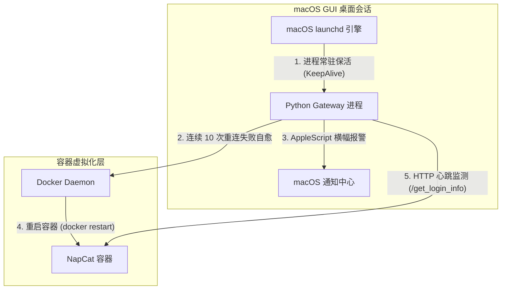

# Xl-General-AI-Agent QQ Gateway 7x24小时生产级常驻与自愈系统设计规范

本文档确立了 QQ Gateway 进程在 macOS (Local GUI) 环境下的系统级守护常驻（launchd）、WebSocket 连不上时的 Docker 自检重启（崩溃自愈）以及 QQ 登录态丢失时的 macOS 原生横幅警报（离线感知）的完整技术设计规范。

---

## 1. 架构拓扑 (Architecture Topology)

整个持久化自治体系分为三层结构，各自承担单一职责，确保系统高内聚、低耦合：



---

## 2. 核心模块技术规约 (Component Specifications)

### 2.1 macOS launchd 常驻托管 (`com.myagent.qqgateway.plist`)

通过在用户的 `~/Library/LaunchAgents` 下部署 plist 配置文件，由 Mac 操作系统级引擎进行托管：

*   **部署路径**：`~/Library/LaunchAgents/com.myagent.qqgateway.plist`
*   **指令参数 (ProgramArguments)**：
    1.  `/Users/xiaofeng/bot-我的自搭建agent/新的agent/Xl-General-AI-Agent/.venv/bin/python`
    2.  `main.py`
    3.  `--gateway`
*   **工作目录 (WorkingDirectory)**：`/Users/xiaofeng/bot-我的自搭建agent/新的agent/Xl-General-AI-Agent`
*   **重启策略 (KeepAlive)**：`true`。任何意外退出（信号击杀、崩溃、OOM）都将在 10 秒内被系统无条件重新拉起。
*   **开机自启 (RunAtLoad)**：`true`。当主人登录 Mac 账户后立即执行。
*   **日志路由**：
    *   标准输出：`gateway.log`
    *   标准错误：`gateway.err`

### 2.2 WebSocket 失败 Docker 自愈环 (`gateway.py`)

在 `QQGateway.run()` 异常处理分支中拦截网络连不上故障，并触发 Docker 自愈动作：

*   **成员状态**：`self._reconnect_failures: int = 0` （在 `__init__` 中初始化）。
*   **状态转移与触发断言**：
    *   **WS 握手成功**：`self._reconnect_failures = 0`。
    *   **WS 握手失败**：`self._reconnect_failures += 1`。
    *   **阈值达成 (Failures == 10)**：触发物理自愈指令：
        ```python
        import asyncio
        proc = await asyncio.create_subprocess_shell("docker restart napcat")
        await proc.wait()
        self._reconnect_failures = 0
        await asyncio.sleep(10) # 挂起 10 秒，等待 Docker 容器完全就绪后再进行下一次握手
        ```

### 2.3 QQ 登录态丢包 Mac 原生横幅警报 (`gateway.py`)

在守护线程 `_daemon_loop` 中，定时检测 QQ 状态：

*   **成员状态**：`self._last_offline_alert: float = 0` （用于防骚扰冷却，单位为秒）。
*   **状态轮询 (每 5 分钟)**：
    *   通过 `self._http.get(f"{NC_HTTP_URL}/get_login_info")` 发送状态心跳。
    *   若接口调用报错（如连接不上 HTTP 接口）或响应结果中 `data.get("online")` 不是 `True`：
        *   **防爆冷却检测**：若当前时间距离 `self._last_offline_alert` 大于 1800 秒（30分钟）：
            *   更新时间戳：`self._last_offline_alert = time.time()`
            *   调用 Mac 原生 AppleScript 横幅报警：
                ```python
                cmd = 'osascript -e \'display notification "QQ 机器人登录态已过期，请扫码登录！" with title "⚠️ XL Agent 掉线警报" sound name "Glass"\''
                await asyncio.create_subprocess_shell(cmd)
                ```

---

## 3. 测试与验收指标 (Acceptance & Test Plan)

为确保该系统的严密性与可靠性，测试时需对准以下 4 个场景进行断言验证：

1.  **进程自愈测试**：
    *   在前台执行 `kill -9 <python-gateway-pid>`。
    *   **断言**：在 10 秒内，`launchd` 应自动拉起新进程，控制台输出 `Background Daemon Loop started`，自愈成功。
2.  **Docker 自愈测试**：
    *   执行 `docker stop napcat` 强行阻断连接。
    *   **断言**：Gateway 开始重连计数。在第 10 次重连失败后，日志中输出 `docker restart napcat` 指令执行，且 `docker ps` 显示 napcat 状态恢复为 `Up`。
3.  **横幅警报测试**：
    *   手动进入 NapCat WebUI 注销 QQ 账号，或拔掉网线。
    *   **断言**：5 分钟内，Mac 屏幕右上角精准弹窗原生通知横幅，并伴随玻璃击碎声（`Glass` 音效）。再次离线时，检查是否处于 30 分钟静默冷却期内，防止持续刷屏。
4.  **开机自启测试**：
    *   Mac 主机重启并登录账户。
    *   **断言**：无需手动打开任何终端，`docker ps` 内的 `napcat` 正在运行，且 `ps aux | grep main.py` 显示 Gateway 进程已被 `launchd` 成功拉起并处于工作状态。
