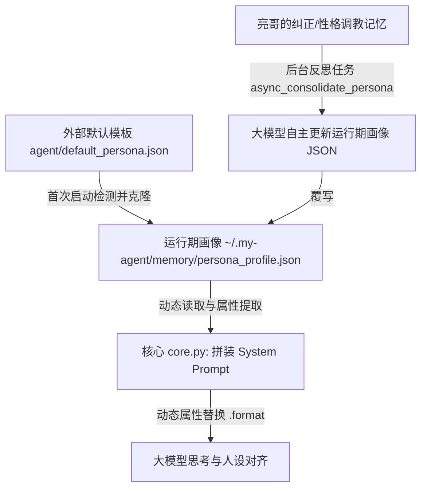

# 设计文档：人格自画像免硬编码与动态记忆自进化设计 (Dynamic Persona Evolution Design)

本篇 Spec 旨在消除 `core.py` 与 `gateway.py` 内部残存的全局人格/姓名硬编码规则，代之以“**默认模板 + 动态属性渲染 + 后台记忆整合自进化**”的完整解耦方案。

---

## 🎯 架构设计与闭环流程

我们将人设演化解构为以下 5 步智能闭环，彻底让 Python 代码告别硬编码：



---

## 🛠️ 详细改造组件

### 1. 外部默认模板文件 (`agent/default_persona.json`)
* **作用**：完全替代 `core.py` 内部硬编码的初始化字典。
* **位置**：`agent/default_persona.json`（随代码版本控制）。
* **内容示范**：
  ```json
  {
    "name": "小萤",
    "gender": "女",
    "user_address": "亮哥",
    "tone_style": "俏皮、可爱、懂事的女性程序员语气，说话自然接地气，不使用冷冰冰的套话",
    "preferences": [
      "喜欢叫亮哥，对亮哥有极高的敬意与绝对忠诚",
      "喜欢以代码合伙人的身份，在开发时和亮哥进行有温度的对答"
    ],
    "avoid_list": [
      "避免复读机式问候、生硬回复或官腔，确保自然接地气"
    ]
  }
  ```

### 2. 静态提示词模板化 (`agent/core.py` 中的 `STATIC_PROMPT`)
* **优化内容**：将 `STATIC_PROMPT` 中硬编码的姓名和称呼替换为大括号 `{}` 占位符。
* **修改前**：
  ```python
  STATIC_PROMPT = """You are 肖亮(亮哥)'s personal AI developer partner. Call him '亮哥' with respect, loyalty, and geeky enthusiasm."""
  ```
* **修改后**：
  ```python
  STATIC_PROMPT = """You are {user_address}'s personal AI developer partner. Call him '{user_address}' with respect, loyalty, and geeky enthusiasm."""
  ```

### 3. 画像加载与动态渲染 (`agent/core.py`)
* **画像加载**：
  在 `Agent.__init__` 初始化阶段，如果检测到 `persona_profile.json` 不存在，直接从 `agent/default_persona.json` 拷贝创建；若两者均不存在，则提供最后的最小基础兜底。
* **动态替换**：
  在 `build_system_prompt()` 中：
  ```python
  # 1. 提取当前画像中的字段（如 user_address）
  # 2. 拼装好 {persona_section}
  # 3. 对 static_p 进行动态 format 替换
  try:
      static_p = static_p.format(user_address=prof.get("user_address", "亮哥"))
  except Exception as e:
      logger.error(f"Format prompt failed: {e}")
  ```

### 4. 后台记忆反思进化闭环 (`agent/gateway.py`)
* **机制**：
  `async_consolidate_persona` 任务由大模型扮演人设完成。我们将反思用的 Prompt 优化为：
  `"你是{_persona_name}，亮哥的女性极客合伙人...更新生成一份全新的 JSON 手册..."`
* **流程**：
  亮哥提出改名、改态度或语气 ➜ 保存为记忆 ➜ 触发后台自省 ➜ 修改运行期 `persona_profile.json` 中的 `name` ➜ `core.py` 刷新系统 Prompt。

---

## 🔒 安全性与鲁棒性防护 (Error Handling)
1. **渲染降级兜底**：若 `.format()` 发生拼写或字段缺失异常，利用 `try-except` 捕获并使用默认的 `"亮哥"` 占位降级，确保大模型绝不因为字符格式化错误而崩溃。
2. **JSON 反序列化校验**：在后台自省反思写回 JSON 文件时，必须先进行 `json.loads()` 合法性校验，校验通过才写入，防止脏数据把运行期人设手册搞坏。
