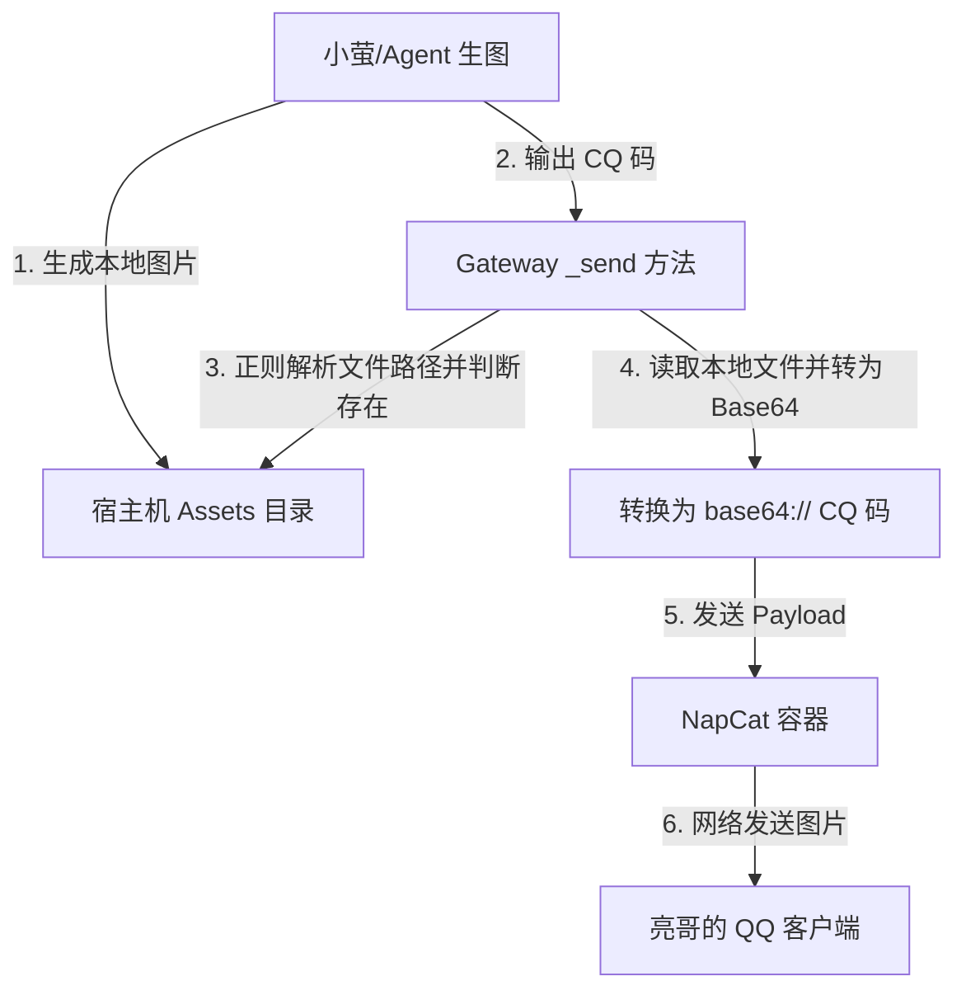

# Xl-General-AI-Agent QQ Gateway 动态图像渲染与 Base64 编码方案设计规范

本文档确立了 QQ Gateway 进程在发送消息时，如何对 `[CQ:image,file=...]` 进行精准路径解析，并利用 Base64 动态编码转换克服 Docker 容器与宿主机环境文件隔离问题，实现图片在 QQ 聊天端无缝呈现的完整技术规范。

---

## 1. 问题背景 (Context & Problem Statement)

在小萤（AI Agent）使用 `image2_generate` 生图工具生成图片后，会在聊天中输出形如以下的 CQ 码：
```text
[CQ:image,file=/Users/xiaofeng/bot-我的自搭建agent/新的agent/Xl-General-AI-Agent/agent/dashboard_v2/assets/gen_A_realistic_portrait_of_a_cute.png]
```

当前系统在发送此消息时存在两个致命缺陷，导致用户在 QQ 中只能看到 `[ CQ:image,file=...` 的转义文本，而无法渲染出图片：
1. **正则表达式解析截断缺陷**：
   在 `gateway.py` 中，旧的正则是 `r'file=([^,\\]]+)'`。它由于没有排查右中括号 `]`，导致解析出来的路径尾部附带了 `]`（如 `/Users/.../gen_xxx.png]`），直接导致 `os.path.exists()` 判断文件不存在，从而将图片码降级转义为非法的 `[ CQ:image`。
2. **容器与宿主机运行环境隔离**：
   由于协议端 NapCat 运行在 Docker 容器内，它没有挂载宿主机项目代码及 assets 图片目录。即便正则提取出了纯净的宿主机绝对路径（如 `/Users/xiaofeng/...`），容器内的 NapCat 也根本无法读取宿主机文件，发送必然失败。

---

## 2. 架构与数据流 (Architecture & Data Flow)

采用 **Base64 动态编码转换** 方案。由于 Python Gateway 直接作为宿主机进程（或在映射了项目代码的容器中）运行，它能够无障碍地读取生成的图片文件。通过在发送前将图片在内存中转换成 Base64 文本，并通过 WebSocket/HTTP 发送给 NapCat，完美绕过隔离限制。



---

## 3. 核心设计规约 (Component Specifications)

### 3.1 精准正则路径解析
在 `agent/gateway.py` 的 `_send` 消息处理分支中，将 `escape_invalid_cq` 中的正则提取逻辑修改为排除 `]` 的安全匹配：
```python
m_file = re.search(r'file=([^,\]\\]+)', cq_str)
```
此正则不仅排除了 `,` 和 `\\`，还明确排除了 `]`，确保能提取到绝对纯净的文件路径。

### 3.2 宿主机与容器路径双向兼容
为了完美兼容**宿主机直接运行**与**Docker 容器内运行**，Gateway 需要具备智能路径纠偏能力：
* 如果检测到路径以宿主机项目根路径（`/Users/xiaofeng/bot-我的自搭建agent/新的agent/Xl-General-AI-Agent`）开头，但文件在当前运行环境（如容器内）中无法直接访问，Gateway 应自动计算当前运行目录，将其重定向至当前环境下的实际相对路径，确保 `os.path.exists()` 检查通过。

### 3.3 动态 Base64 编码转义
对于所有校验存在的本地图片路径，执行以下转换操作：
1. 以二进制读取文件：`data = f.read()`
2. 对图片进行 Base64 编码：`b64_data = base64.b64encode(data).decode('utf-8')`
3. 动态组装为 Base64 协议的图片 CQ 码：`[CQ:image,file=base64://{b64_data}]`
4. 对于已转换为 Base64 或以 `http(s)://`、`base64://` 开头的合法 CQ 码，直接放行，不做二次转义。

---

## 4. 验收与验证计划 (Acceptance & Test Plan)

1. **绝对路径测试**：
   * 构造包含合法绝对路径图片的测试文本：`[CQ:image,file=/Users/xiaofeng/.../gen_A_realistic_portrait_of_a_cute.png]`。
   * **断言**：Gateway 终端后台不应报任何异常，聊天界面应该流畅展现出生成的自画像图片。
2. **非法路径退避**：
   * 构造包含不存在文件的测试文本：`[CQ:image,file=/invalid/path/nonexistent.png]`。
   * **断言**：该 CQ 码被安全转义为 `[ CQ:image` 并以文本形式输出，不引发进程崩溃。
3. **网络与 Base64 直通测试**：
   * 构造包含网络图片或已存在的 Base64 图片的文本。
   * **断言**：Gateway 原样放行，NapCat 正常解析渲染。
