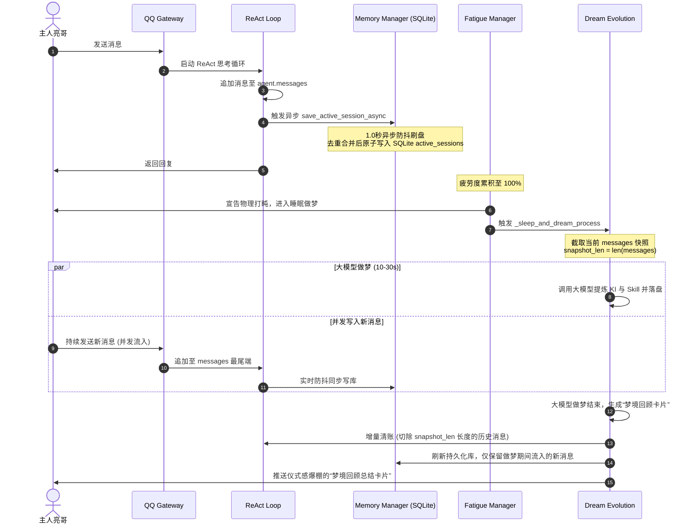

# 🧠 小萤灵魂记忆不灭：高韧性短期记忆实时持久化防丢与仪式感梦境进化系统设计 spec

> [!NOTE]
> 本文档定义了小萤在频繁交互期间抵抗“网关物理重启断电失忆”的韧性防御架构，并升级了疲劳唤醒时的“高情商梦境回顾总结”仪式感体验。本 Spec 已与主人亮哥达成多轮白盒共识，一经批准即刻转入落地实现。

---

## 1. 🎯 设计目标与痛点解决

### 1.1 痛点一：进程意外重启/掉线引发的短期记忆物理丢失（断电失忆）
*   **现状**：当前交互中的短期上下文历史消息完全保存在 `agent.messages` 内存列表里。一旦宿主机上的 Gateway 守护进程（`start.sh`）因配置热加载或意外崩溃触发重启，内存数据被彻底释放，用户将遭遇突发性的失忆症。
*   **自愈设计**：引入 **`active_sessions` 短期记忆持久化表**。采用 **1.0 秒异步防抖刷盘机制**，在 ReAct 循环或消息队列吞吐的每一刻，以近乎 0 毫秒的性能开销，将短期上下文实时同步至 SQLite，保障网关冷启动时灵魂记忆 100% 自动还原。

### 1.2 痛点二：高并发做梦期间流入新消息的清账冲突（断层失忆）
*   **现状**：做梦蒸馏提炼（`trigger_deep_dream_evolution`）需要发起多轮 LLM 大模型推理，通常耗时 10-30 秒。如果在休眠做梦期间用户继续发送新消息，做梦结束后如果直接清空 `agent.messages`，会导致做梦期间流入的最新消息被强行抹除。
*   **自愈设计**：引入 **快照增量清账机制**。在做梦前对消息队列截取唯一快照，做梦结束后只切除快照包含的这部分老历史，完美保留并衔接做梦期间流入的所有最新消息。

### 1.3 痛点三：静默唤醒的冷冰冰体验（缺乏情商反馈）
*   **现状**：做梦反思属于后台静默处理，梦醒时只有一句干瘪的“小萤满血复活啦”。用户看不见 Agent 是否真正汲取了经验。
*   **自愈设计**：引入 **大模型梦境反思回顾卡片 + 本地自愈 Fallback 机制**。在醒来时，大模型会生成一份饱含动作描写、包含“自我反省、新策略、技能更新”的精美 Markdown 卡片，向亮哥汇报自己梦境中的领悟；若 API 偶发超时失败，则使用本地自愈模板物理拼装已登记的 KI 统计，确保 100% 可用性。

---

## 2. 🗄️ 数据库 DDL 升级规范

我们在长期记忆数据库 `memories.db` 中新建短期消息持久化表 `active_sessions`。此操作将在系统引导 bootstrap 阶段由 DDL 自愈器自动检测并创建：

```sql
CREATE TABLE IF NOT EXISTS active_sessions (
    session_key TEXT PRIMARY KEY,
    messages TEXT NOT NULL,       -- JSON 序列化消息数组
    updated_at TEXT NOT NULL      -- UTC ISO-8601 时间戳
);
```

---

## 3. 🚀 核心技术架构设计



---

## 4. 📝 关键算法与机制实现细节

### 4.1 异步内存双通道防抖刷盘（1.0秒 Debounce）
为了将磁盘 I/O 延迟控制在纳秒级，我们不采用每次变动都同步写磁盘的方式，而是基于 `asyncio` 协程建立防抖写通道：
*   在 `MemoryManager` 内部维护一个 `self._debounce_tasks = {}` (映射 `session_key` 到其对应的刷新 Task)。
*   每次调用 `save_active_session_async(session_key, messages)` 时：
    1. 若 `session_key` 已存在挂起的 Task，则直接 `task.cancel()` 强行物理取消，杜绝并发抖动。
    2. 重新创建一个全新的延迟 1.0 秒的刷盘 Task：
       ```python
       async def _do_debounce_write(session_key, messages_data):
           await asyncio.sleep(1.0)
           # 执行真正的事务级原子刷写 SQLite active_sessions
           db.execute("INSERT OR REPLACE INTO active_sessions ...")
       ```
    3. 这样，在一轮密集的 ReAct 循环或工具链连续调用中，只有在最后一次交互静止满 1 秒时，才会真正触发一次高效的磁盘同步写。

### 4.2 高并发快照增量清账机制
为了确保小萤在长眠做梦期间不会因清账抹去亮哥新发的信息：
1.  **做梦引导阶段**：
    ```python
    # 截取快照
    snapshot = list(agent.messages)
    snapshot_len = len(snapshot)
    
    # 启动异步做梦，传入快照进行分析
    asyncio.create_task(trigger_deep_dream_evolution(agent, snapshot))
    ```
2.  **睡眠等待与新消息流入**：做梦期间所有的普通消息、RAG 或工具调用正常运转，`agent.messages` 会追加新消息。
3.  **做梦归档阶段**：做梦完成后，在主协程安全执行切片清账，并将变化同步至 SQLite：
    ```python
    if len(agent.messages) >= snapshot_len:
        # 切片截断，完美保留快照以后流入的最新消息
        agent.messages = agent.messages[snapshot_len:]
    else:
        agent.messages = []
        
    # 同步同步回 SQLite，清除老记忆防丟
    await agent.memory.save_active_session_async(session_key, agent.messages)
    ```

### 4.3 高情商梦境回顾总结卡片生成
在 `dream.py` 中，定义梦境卡片提炼 Prompt。
大模型梦境生成时，基于本次做梦期间真实产生的新 KI（自愈入库的 Facts）和突变的 Skill，生成如下结构的 Markdown 报告：

```markdown
### 📊 梦境回顾总结

**回顾了最近 {N} 轮会话**，发现有以下值得注意的点：

#### ⚠️ 发现的主要问题（自我反省）
1. [自省大模型分析的问题点1]
2. [自省大模型分析的问题点2]

#### 💡 新提炼的策略
* 当亮哥指示...时：[大模型总结的新经验策略]
* [其他大模型反思的调试/避坑新策略]

#### 🛠️ 技能库整理
* 整理前：{old_count} 个技能 ➔ 整理后：{new_count} 个技能（新增了【技能名】）
* 核心记忆库：已完成相似度吞噬合并，大脑已深度压缩净化！
```

#### 🛡️ 容灾 Fallback 本地自愈模板
若 LLM 在生成卡片时超时（超过 8 秒限制）或发生 4xx/5xx API 异常，自动退入 Fallback。依据本次做梦真实产生的 `learning_ids` 列表与突变 `skill_names` 列表，在本地拼装无损的统计卡片：
```markdown
### 📊 梦境回顾总结 (系统离线提炼)

由于网络连接波动，小萤通过副脑为您快速整理了本次梦境精简成果：

#### 💡 本次睡眠提炼的硬事实
* 提炼了 {ki_count} 条关于系统教训或用户画像的核心记忆事实（已安全存入 SQLite memories.db 库）。

#### 🛠️ 技能库突变状态
* 突变合成了 {skill_count} 个全新的自进化技能，已自动登记落盘至技能库。
* 核心记忆库已完成去重吞噬熔接，算力已完全恢复 100% 满血状态！
```

---

## 5. 🧪 自动化测试验证设计

为了实现高可靠性的 TDD 品质，我们将补充以下核心白盒单元测试：
1.  `test_active_session_recovery`：验证网关重启冷启动时，`MemoryManager` 能够 100% 从 `active_sessions` 关系表自愈还原 `agent.messages`。
2.  `test_session_write_debounce`：验证 1.0 秒防抖机制。在 0.5 秒内连续调用 10 次 `save_active_session_async`，验证数据库实际上只触发了 1 次物理写入。
3.  `test_snapshot_incremental_compaction`：模拟做梦期间并发追加 3 条新消息，验证做梦结束后，清账算法能够精准截断历史快照，并在内存和 SQLite 中完美保留最新的 3 条消息。
4.  `test_dream_card_fallback_recovery`：在 mock 大模型超时异常时，验证本地自愈模板能够 100% 生成格式化卡片返回，杜绝假死。

---

## 6. 🔒 避坑防线

1.  **绝对禁止全局重启网关进行物理验证**：由于物理重启会导致真实 Gateway 的小萤微信/QQ 内存 Session 中断，在开发和本地验证阶段，我们**必须 100% 使用高仿真 Pytest 单元测试和 mock 数据进行验证**，坚决不进行真实网关的强制重启！
2.  **避免 SQL 独占死锁**：在异步防抖写入时，使用已对齐的 WAL 隔离机制和独立的 SQLite 写事务，以防锁死其它高频读操作。
