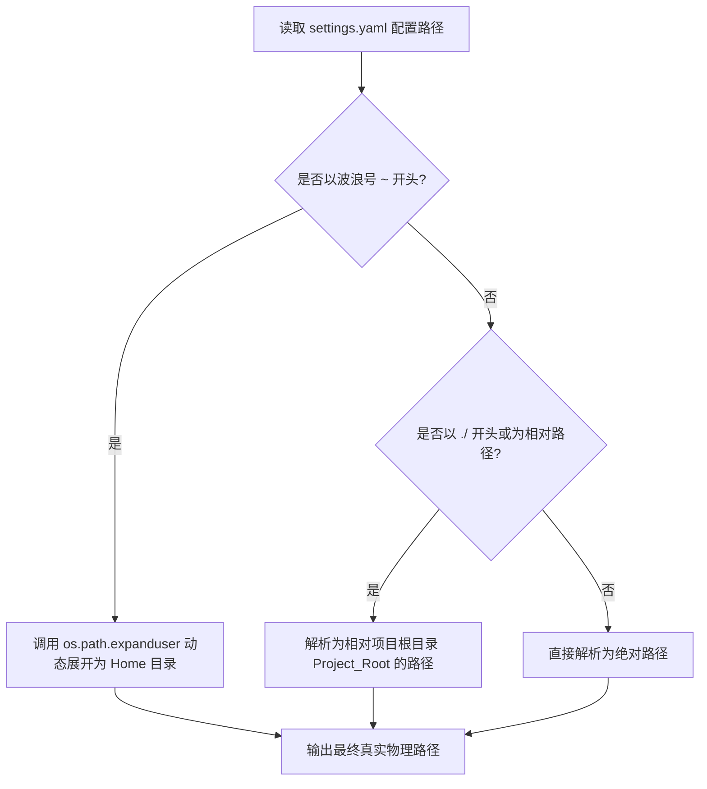

# 🤖 XL Agent 记忆库物理沙箱化与跨平台解耦设计说明书

## 1. 🎯 核心背景 (Background & Value)
为了让小萤在未来能够极其便利、0毫秒冷启动地**“换个家”**（即轻松迁移至别的云服务器、新电脑、或者是新的项目目录中），同时防范在同一台电脑上“多开实例”时产生的 SQLite 文件独占冲突与数据污染，系统必须彻底废除原有的绝对路径与硬编码，升级为**“物理沙箱自封包（Self-Contained Sandbox）与自适应路径动态解析”**架构。

---

## 2. 💎 核心架构与数据流图 (Architecture & Data Flow)

### 2.1 路径自愈动态解析引擎 (Adaptive Path Resolver)
当系统从 `config/settings.yaml` 中读取配置路径时，内置的解析器将遵循以下法则实现“全平台动态自愈”：



### 2.2 多开实例物理沙箱隔离
为了让不同 QQ 号的机器人（实例）在单台机器上多开时互不相扰，记忆物理路径将自动与超级管理员的 `admin_id`（QQ 号）进行哈希子目录强绑定：

📂 **沙箱物理目录结构**：
```text
Xl-General-AI-Agent/ (项目根目录)
├── .memory/                               <-- 项目内自封包沙箱 (已在 .gitignore 中物理强隔离)
│   ├── 1705919142/                        <-- 属于 QQ 1705919142 实例的独立“灵魂”
│   │   ├── memories.db                    <-- 独立 SQLite 数据库
│   │   ├── MEMORY.md                      <-- 独立索引
│   │   └── user_profile.md, xl_identity.md <-- 核心配置
│   └── 1911828529/                        <-- 属于 QQ 1911828529 实例的独立“灵魂”
│       ├── memories.db
│       └── ...
```

---

## 3. ⚙️ 具体设计与重构方案

### 3.1 集中配置中央收纳
在根目录 [config/settings.yaml](file:///Users/xiaofeng/bot-我的自搭建agent/新的agent/Xl-General-AI-Agent/config/settings.yaml) 中进行全新字段收归：

```yaml
# config/settings.yaml
security:
  admin_id: "1705919142"                        # 唯一超级管理员 QQ 归口

memory:
  base_dir: "./.memory"                         # 记忆库默认采用项目内自封包沙箱路径
  multi_instance_isolation: true               # 强力开启多开实例物理隔离

knowledge_base:
  notes_paths:                                  # 增量学习笔记路径列表，支持 ~ 动态解析
    - "~/Desktop/学习笔记/Agent开发"
    - "~/Desktop/学习笔记/后端开发"
  kb_dir: "~/Documents/个人博客/学习笔记/agent自主学习的东西"
```

### 3.2 动态解析与 fallback 自愈逻辑

#### A. 绝对路径解耦 (context.py & store.py)
* 在进行增量同步（`sync_incremental`）与检索时，系统循环遍历 `notes_paths` 中的路径。
* 每一个路径都会在运行时使用 `os.path.expanduser()` 进行展开。
* **物理防空自愈**：如果检测到某路径在当前系统下物理上不存在，**直接通过 logger 记录一条 DEBUG 状态日志并安全跳过**，绝对不抛出致命报错，也绝对禁止私自在用户桌面上制造空文件夹，维持完美的 UX 体验！

#### B. 核心文件管理员 QQ 解耦 (agent.py, bot.py, base.py)
* 剔除所有 Python 源码中写死的 `1705919142`。
* 统一升级为由中央 `settings` 或系统环境变量 `os.getenv("QQ_ADMIN_ID")` 动态读取，实现单点管理。

---

## 4. 🧪 验证计划 (Verification Plan)

### A. 自动化测试
1. 新增一个单元测试 `tests/test_sandbox_decoupling.py`，专门模拟以 `./.memory_test` 等相对路径初始化 `MemoryManager`，验证其定位是否完美落在项目根目录下。
2. 模拟不同的 `admin_id`，验证 SQLite 数据库是否自动归档在不同的哈希隔离文件夹下，确保多开安全。

### B. 手动验证
1. 亮哥可以直接打包项目目录，移动到其他物理机上，验证修改 `settings.yaml` 后，小萤是否可以 0ms 瞬间带走所有记忆和设定并重新完美启动。
