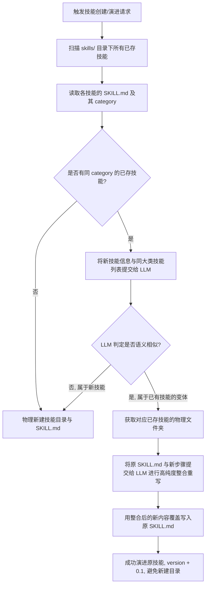

# 智能体技能去重与渐进式演进系统设计规范 (Spec)

## 1. 概述与背景
目前项目的 `skills/` 物理目录存在严重的膨胀冗余（37个子目录），绝大部分在重复定义“唤醒”、“暗号校验”、“状态巡检”等逻辑。
究其原因，是技能生成模块（`SOP检测` 和 `深夜做梦`）缺乏**语义查重与智能合并**机制，大模型每次输出微小名称差异即会导致物理上新建子目录。

本设计旨在通过**方案 A（大模型语义查重分类合并）**，实现技能的渐进式“一步步进化”与“在原有技能基础上优化”，并提供一次性的物理遗留目录蒸馏清理工具。

---

## 2. 核心架构设计

### 2.1 技能分类隔离机制 (Category Isolation)
为防止大模型发生跨领域技能的“误合并”，在技能的 YAML Frontmatter 中强制引入 `category` 属性。
预设的核心分类大类：
1. **`verification` (安全核验与暗号)**：负责与亮哥的暗号交互、身份校验。
2. **`system_status` (日常状态巡检)**：负责服务器、网关、WebSocket 等系统状态的循环健康检查。
3. **`personal_assistant` (个性化特制助手)**：负责亮哥特制的日常会话暗号回答等趣味/个性化交互。
4. **`development` (代码与工具开发)**：负责辅助开发、智能编码或具体操作 SOP。

### 2.2 智能查重与演进流程 (Semantic Deduplication & Evolution)

当触发 `create_skill` 或 `register_skill_evolution` 时，系统将执行以下智能过滤判定流程：



### 2.3 语义判定与智能整合 Prompt 设计

#### 查重 Prompt (Deduplication Check)
```
你是一个高阶智能体技能归类查重引擎。现在有以下同大类下的已有技能列表：
{existing_skills_list}

当前试图创建/演进一个新技能：
名称: {new_name}
触发词: {new_trigger}
步骤: {new_steps}

请判断：
当前新技能是否是已有技能列表中的某一个的“语义变体”或“相似场景操作”？
只输出 JSON 格式：
{
  "is_similar": true/false,
  "similar_skill_folder": "如果相似，输出其文件夹名；否则为 null",
  "reason": "判断依据简述"
}
```

#### 合并 Prompt (Intelligent Merge)
```
你是一个高阶智能体技能进化整合引擎。现在需要将一个相似的新操作步骤（New Version）合并入已有的技能文档（Old Version）中，使之更严密、无冗余。

已有技能文档 (Old Version):
{old_content}

新操作步骤 (New Version):
触发词: {new_trigger}
步骤: {new_steps}

请通盘考虑两者的触发条件和执行步骤，完全智能整合重写出一份最高纯度、步骤逻辑清晰、无冗余的全新 SKILL.md 文本（包含完整的 YAML frontmatter，且版本 version 需累加，usage_count 与 success_count 需合并保留）。
不要输出任何 Markdown 外包裹的解释。
```

---

## 3. 一次性物理清理与蒸馏机制

针对当前已有的 37 个冗余子目录，编写一个一次性物理蒸馏脚本 `agent/core/cleanup.py` 中的 `distill_legacy_skills()` 函数：

1. **信息载入**：扫描 `skills/` 下所有的子目录，读取其 `SKILL.md`，提取名称、触发词和具体步骤。
2. **LLM 聚类合并**：将这 37 个原始步骤汇总输入给大模型，要求大模型将它们精密蒸馏为 **3 个核心高纯度技能**：
   - `identity_verification_lock`（安全验证与暗号核验）
   - `system_status_check`（系统状态巡检与防双进程冲突）
   - `liang_custom_response`（亮哥特制暗号回答）
3. **物理替换**：
   - 在 `skills/` 下仅保留这 3 个蒸馏后的高质量技能文件夹。
   - 彻底 `rm -rf` 其余 34 个字面稍微不同的冗余子文件夹。
4. **测试校验**：确保清理后，技能管理服务及自适应导入无异常。

---

## 4. 提交与规范约束

- **修改前请示**：在亮哥明确输入“可以写”或“同意”前，绝不擅自更改任何核心 Python 代码。
- **Git 提交格式**：每次分小步提交，记录格式与前期保持高度一致的中文，例如：
  `feat(skills): 引入分类隔离与LLM语义查重，防止技能目录物理膨胀`
  `refactor(cleanup): 实现遗留的37个冗余技能一次性物理蒸馏合并`
