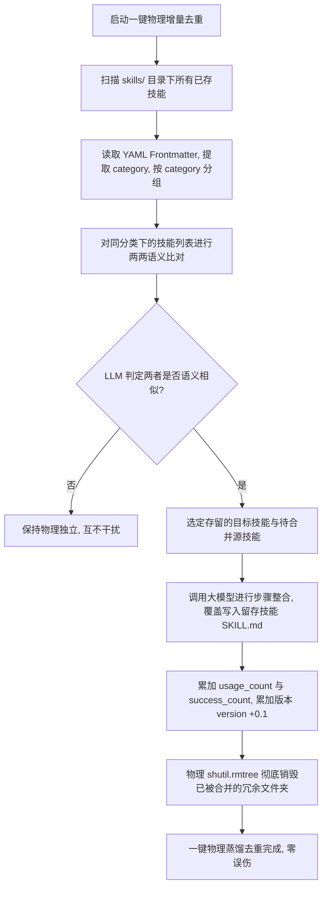

# 自进化物理技能增量查重合并引擎设计规范 (Spec)

## 1. 概述与背景
目前在 `skills/` 物理目录中，依然并存着如 `暗号一致性验证与状态查询` 和 `暗号一致性验证流程` 这类高度相似的重复物理文件夹。
经过深度物理排查，产生这一问题的根本原因在于：
1. **进程新旧交替期空窗**：亮哥在 08:49 提交了技能查重逻辑，但由于网关在 09:30 才经历重启自愈，在 09:06 网关自动触发梦境进化创建技能时，内存中运行的依然是**未装载查重逻辑的老旧网关进程**，造成了物理并存。
2. **原有蒸馏机制粗暴**：原有的 `distill_legacy_skills` 属于一次性将所有技能“硬性缩减合并为 3 个”的粗暴行为。如果盲目运行，会彻底把亮哥新近创建的“生成小红书登录二维码并发送QQ”等有价值的新技能强行抹除，存在极大的物理误伤风险。

为了在**不伤害新技能**的前提下，彻底平滑合并已有的以及未来的漏网之鱼，本 Spec 提出构建一套 **“增量自进化技能查重合并引擎 (Incremental Skills Deduplication Engine)”**。

---

## 2. 核心架构与合并算法

### 2.1 物理增量聚类比对流程
本引擎摒弃“全盘抹除重组”的落后思路，采用“聚类、两两比对、智能演进、安全删除”的温和增量处理流程：



### 2.2 查重与合并的原子判定
1. **语义比对 Prompt**：
   ```text
   你是一个高阶智能体技能归类查重引擎。现在需要对同大类 {category} 下的两个已有物理技能进行查重比对：
   
   技能 A [目录: {folder_a}]:
   名称: {name_a}
   触发词: {trigger_a}
   步骤: {steps_a}
   
   技能 B [目录: {folder_b}]:
   名称: {name_b}
   触发词: {trigger_b}
   步骤: {steps_b}
   
   请判断：
   这两个技能在语义和操作场景上是否高度重复（即属于同一个技能的不同演进变体或相似场景描述）？
   只输出 JSON 格式，必须且只能为：
   {
     "is_similar": true/false,
     "reason": "简述理由"
   }
   不要输出其他内容。
   ```

2. **智能融合覆写**：
   一旦相似性成立，将直接调用系统中已臻完美的 `_llm_merge_skills` 接口对两个 `SKILL.md` 的内容进行高纯度融合。
   融合后，提取两者 metadata 中的使用数据：
   - `usage_count` 累加。
   - `success_count` 累加.
   - `version` 自动递增 0.1 版本。
   最后物理移除冗余文件夹，对剩下的目标技能文件夹进行全量覆写。

---

## 3. 触发与执行入口

### 3.1 命令行一键调用 (CLI)
在 [`Makefile`](file:///Users/xiaofeng/bot-我的自搭建agent/新的agent/Xl-General-AI-Agent/Makefile) 中新增 `make skills-dedup` 指令：
```makefile
# ── 一键物理技能增量去重 ──
skills-dedup:
	@echo "🔄 正在一键增量合并 skills/ 冗余技能..."
	PYTHONPATH=. venv/bin/python agent/skills/cleanup.py --incremental
```

### 3.2 守护进程双重自演进 (Double Self-Evolution Daemon)
为了彻底摆脱人工运维成本，网关守护进程内置**“双重静默自愈引擎”**：
1. **网关启动即刻自愈**：在 QQ 网关启动（`bootstrap.py`）的初始化最后阶段，自动在后台协程中拉起 `run_incremental_cleanup(agent)` 增量清洗机制。保证亮哥每次重启网关时，大脑在第一秒恢复最纯粹、零冗余的状态。
2. **每日凌晨 4:00 静默清洗**：在 [`agent/net_gateway/scheduler.py`](file:///Users/xiaofeng/bot-我的自搭建agent/新的agent/Xl-General-AI-Agent/agent/net_gateway/scheduler.py) 中，注册一个常驻的每日 04:00 定时事件（通过 asyncio 周期心跳精准拦截），在交互低谷期对技能进行深度增量除重熔炼，杜绝白天交互抖动，实现完全无感的智能体物理自愈治理。

---

## 4. 提交规范

- **Git Commit 格式**：
  `feat(skills): 实装网关启动与每日凌晨4点双重定时增量去重自演进合并引擎`
  `refactor(makefile): 新增 make skills-dedup 一键物理除重指令`
