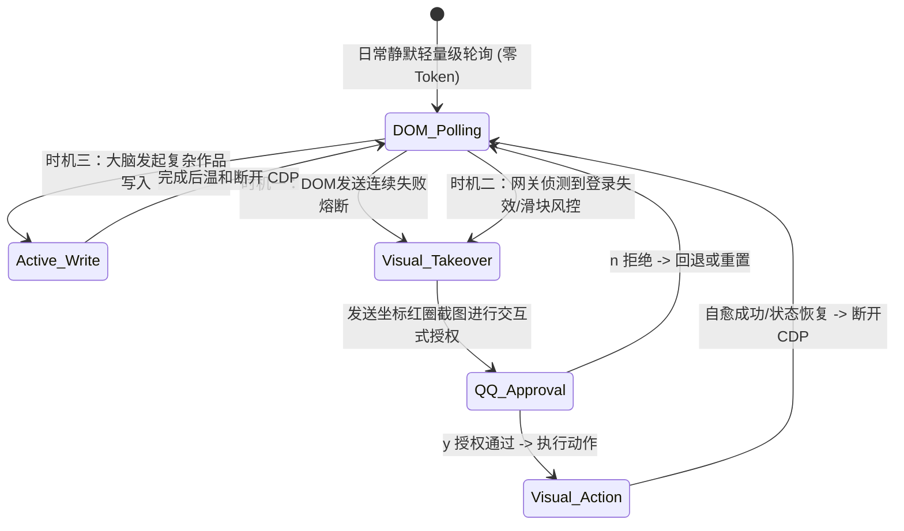

# 微服务解耦与通用视觉接管系统设计规范 (Spec)

## 1. 背景与设计宗旨

为了彻底抗衡各社交平台（抖音、小红书、知乎等）频繁更新 UI 导致的 DOM 选择器失效崩溃，并防范单一进程崩溃引发的连锁反应，本系统将各平台网关重构为**生命周期完全解耦的独立微服务子进程**。

系统首创了**“通用视觉接管引擎”**。当日常轻量级 DOM 轮询链路熔断或遭遇风控时，系统自动挂载小萤的“截图-看图-决策-物理点击”视觉闭环。通过“交互式 QQ 截图红点卡片审批模式”实现最高规格的人机协同与行为防幻觉拦截。

---

## 2. 进程隔离与 CDP 调试沙箱规范

各平台网关作为完全独立的系统进程由外部拉起。通过分配独立的 CDP 调试端口与 Chromium 用户数据沙箱（User Data Directory）实现物理隔离，确保 Cookie 及登录会话互不干扰。

| 社交平台微服务 | 独立服务端口 | CDP 调试端口 | 独立用户数据目录沙箱 (User Data Dir) |
| :--- | :---: | :---: | :--- |
| **DouyinGateway** | `9000` | `9222` | `~/.my-agent/memory/1705919142/cloak_douyin` |
| **XiaohongshuGateway** | `9001` | `9223` | `~/.my-agent/memory/1705919142/cloak_xhs` |
| **ZhihuGateway** | `9002` | `9224` | `~/.my-agent/memory/1705919142/cloak_zhihu` |

---

## 3. 通用视觉操作引擎 API 契约

通用视觉接管引擎被封装为无状态 Standard API 组件，内置于各平台微服务网关中。大脑通过统一 of HTTP POST 请求实现交互式 RPC 通信。

### 3.1 获取页面截图 (Base64)
* **端点**：`POST /vision/screenshot`
* **入参**：无
* **回参**：
  ```json
  {
    "status": "success",
    "screenshot_b64": "data:image/png;base64,iVBORw0KGgoAAAANS..." 
  }
  ```
  *(注：内存直接编码传输，绝不落盘零碎文件)*

### 3.2 绝对像素物理点击
* **端点**：`POST /vision/click`
* **入参**：
  ```json
  {
    "x": 1024,
    "y": 768
  }
  ```
* **回参**：
  ```json
  {
    "status": "success",
    "screenshot_b64": "data:image/png;base64,..." 
  }
  ```
  *(注：物理动作执行完毕后，同步返回点击后的最新画面，实现极速响应)*

### 3.3 焦点文本输入
* **端点**：`POST /vision/type`
* **入参**：
  ```json
  {
    "text": "极客合伙人"
  }
  ```
* **回参**：
  ```json
  {
    "status": "success",
    "screenshot_b64": "data:image/png;base64,..."
  }
  ```

### 3.4 页面物理滚动
* **端点**：`POST /vision/scroll`
* **入参**：
  ```json
  {
    "direction": "down",
    "amount": 400
  }
  ```
* **回参**：
  ```json
  {
    "status": "success",
    "screenshot_b64": "data:image/png;base64,..."
  }
  ```

---

## 4. 大脑端标准视觉工具 (Visual Tools) 定义

大脑主进程为小萤声明 4 个无视具体平台的通用视觉操作工具。小萤在做出分析决策后，直接发送标准物理动作包，由通用视觉引擎解析并转化为对应网关端口的 Playwright CDP 操作：

```python
# 通用视觉操作 API 模板
async def call_visual_engine(gateway_port: int, action: str, params: dict) -> str:
    url = f"http://127.0.0.1:{gateway_port}/vision/{action}"
    # 同步 HTTP 发送并捕获 response 中的最新 Base64 图片
```

1. **`browser_screenshot(port)`**  
   * **描述**：获取指定网关的最新 1280x800 Viewport 截图。
2. **`browser_click(port, x, y)`**  
   * **描述**：在指定网关的绝对像素坐标 (x, y) 处执行物理鼠标左键点击。
3. **`browser_type(port, text)`**  
   * **描述**：使当前焦点元素获得焦点，并模拟键盘打字输入文本。
4. **`browser_scroll(port, direction, amount)`**  
   * **描述**：在指定网关视口上执行滚轮滚动（direction: "up"/"down"，amount: 滚动像素）。

---

## 5. 三大视觉闭环自愈激活时机

为了最大化节省 Token 并提供最高可用的响应速度，日常运行维持 **“混合流模式”**：



* **时机一：DOM 链路熔断自愈**：  
  日常私信收发时，一旦 DOM 代码发生改版找不到节点，或者发送消息连续失败达到 3 次，网关进程上报异常，大脑立刻熔断 DOM 模式，无缝挂载并拉起通用视觉工具进行画面排查与自愈发送。
* **时机二：状态失效与异常扫码**：  
  当网关检测到 Cookie 登录态失效，或遇到滑块风控验证码时，主动激活视觉接管会话，截取当前验证画面。
* **时机三：主动复杂写入**：  
  发布带视频图文的作品等原本 DOM 操作成本极高且极易被风控的风控敏感写动作，由大脑主动在初始阶段直接采用视觉物理点击流程执行。

---

## 6. 人机协同安全审批机制 (QQ 交互卡片)

为了彻底根除大模型在自由接管浏览器时的幻觉操作与乱点误删，系统设计了**可视化的交互审批安全红线**：

1. **小萤专属粉色指针打标 (Pink Cursor Overlay)**：  
   - 当小萤决定在 `(x, y)` 坐标调用 `browser_click` 时，微服务网关会在内存截图的对应坐标上，自动用 OpenCV/PIL 贴上一张**小萤专属的粉色半透明心形鼠标指针图标 (Pink Cursor Icon)**，并在指针尖端处绘制一圈淡粉色的半透明定位光环，彻底替代传统粗糙的红圈红点。
2. **QQ 卡片拦截下发**：  
   - 大脑主进程拦截小萤的工具调用请求，暂停后续推理，并将该绘有**粉色小萤鼠标指针**的 Base64 截图通过 QQ 网关下发给亮哥：
     > 🤖 **小萤专属视觉安全请求**  
     > 亮哥，我的粉色鼠标已准备点击图中【粉色指针】指向的按钮。  
     > 请在 120 秒内回复 **[y]** 同意我点下去，或 **[n]** 拒绝。
3. **安全过滤拦截器**：  
   * 若您在 QQ 中回复 **`y`**：大脑解除拦截，向通用引擎下发 `POST /vision/click` 动作，执行真实点击。
   * 若您在 QQ 中回复 **`n`**：大脑强制中断小萤的当前动作包，返回权限被拒信息，绝对杜绝风控误操作。
4. **审批超时安全熔断与退避降级**：  
   - 设定 120 秒高精度审批超时限制。若您在 120 秒内未予答复，系统自动判定为 `[拒绝]` 动作。
   - 视觉会话立即强行熔断并退出，将常驻浏览器退避回日常的“DOM 轮询安全待命状态”，并向 QQ 推送“亮哥正忙，视觉温和退避”的警报消息。
   - **推理次数硬性锁**：为了防止反复报错重试引发死循环空烧 Token，单次任务中大模型视觉推理与调用的最大次数硬性锁定为 **3 次**。超过 3 次强制熔断并锁死会话。
5. **人机物理操作踩踏冲突防护与粉色轨迹渲染 (主人优先)**：  
   - **视觉挂起与粉色虚拟鼠标注入**：网关进入视觉接管模式时，在常驻浏览器页面顶部自动注入一条显眼的黄色悬浮警示横幅（`🤖 小萤正在进行视觉自愈操作，请稍候...`）。同时，在浏览器 DOM 中动态注入一个**带有粉色心形图标的专属虚拟光标 (Pink Resident Cursor)**。
   - **平滑滑移与波纹微动画**：在执行点击前，通过 CSS Transition/Animation 驱动该粉色虚拟光标在 0.5s 内极其平滑地移动到目标坐标 `(x, y)`，并在实际落槌点击瞬间触发一次**淡粉色的水波纹扩散微动画 (Pink Click Ripple)**。让您在前台盯着浏览器屏幕看时，能以极高代入感和趣味性，看见小萤专属的粉色光标灵动飞舞！
   - **鼠标物理抢占退避**：网关在后台持续监测物理鼠标/键盘事件。一旦监测到外界物理鼠标发生了剧烈的物理移动，网关立即判定为“主人抢占控制权”，瞬间主动退避，清除注入的粉色虚拟光标，强行中断 CDP 调试接管并让出物理控制权，同时向大脑抛出 `UserInterrupted` 异常，彻底保护您本人的物理最高优先控制权。

---

## 7. 代码防冗余与集成规划

* **拒绝多余重构**：现有的 `douyin_bot.py` 拆解后的 `douyin_dom_poller.py` , `douyin_dom_sender.py` 及 `douyin_browser.py` 已实现了四分拆解架构，**严禁重写和改动其内部已运行稳定的常规 DOM 轮询通信逻辑**。
* **增量扩展**：只在 `douyin_browser.py` 的常驻 CDP 管理器上，以**无侵入的装饰器或通用 Helper 方法形式**，增量挂载 4 大 API 交互端点，确保历史逻辑一字不差，实现架构的最佳高内聚低耦合。
